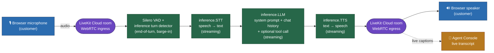

# Real-Time Voice Agent — Customer Verification Assistant

A browser-based, real-time voice agent built with **LiveKit Agents (Python)**, **LiveKit Cloud** and
**LiveKit Inference** for the entire STT → LLM → TTS pipeline.

The agent, "Aria", greets the customer, asks for their name, walks them through three verification
questions (PAN, bank account, selfie), answers three FAQs on demand at any point in the
conversation, summarises the answers back, asks whether anything else is needed, and closes
politely.

All conversation logic lives in the **system prompt** (`prompts.py`) — there is no hardcoded
dialogue state machine. The prompt explicitly enumerates the step order and instructs the LLM to
track what has already been asked using the conversation history.

---

## 1. Conversation script

| Step | What the agent does |
|------|---------------------|
| 1 | Greets the customer, introduces itself as the Customer Verification Assistant |
| 2 | Asks for the customer's full name |
| 3 | Asks: "Have you completed your PAN verification?" |
| 4 | Asks: "Have you completed your bank-account verification?" |
| 5 | Asks: "Have you uploaded your selfie?" |
| FAQ | Answers **why verification is required**, **how long it takes** and **whether the information is secure** — at any point, then resumes the script |
| 6 | Summarises the name + the three answers and asks the customer to confirm |
| 7 | Asks whether further assistance is needed |
| 8 | Closes politely |

Bonus tool: if the customer asks "what's my status?", the LLM calls
`check_verification_status(customer_name)`, which is backed by `mock_data.py`.

---

## 2. Architecture



**Audio path (all streaming, no batch anywhere)**

1. The customer speaks into the browser microphone; audio is published to the LiveKit Cloud room
   over WebRTC.
2. `AgentSession` feeds that audio to **Silero VAD** and the **LiveKit turn detector**, which decide
   when the customer has finished their turn (end-of-utterance) and detect barge-in.
3. `inference.STT` streams the speech to text (partial transcripts arrive while the customer is
   still talking).
4. `inference.LLM` streams the completion token-by-token, using the system prompt plus the chat
   history that `AgentSession` maintains automatically. It may emit a tool call instead of text.
5. `inference.TTS` starts synthesising audio as soon as the first sentences arrive from the LLM
   (sentence-by-sentence streaming), so the customer hears a reply before the LLM has finished.
6. The audio frames are published back into the room; the browser plays them and the Agent Console
   shows the live transcript. Every turn is also logged to stdout and saved to JSON on close.

### Interruption / barge-in handling

`AgentSession(allow_interruptions=True)` is set explicitly (it is also the framework default). When
the customer starts speaking while the agent is talking:

- VAD/STT detect speech during playback, and the session **cancels the in-flight LLM generation and
  stops TTS playback** immediately, so the agent goes quiet instead of talking over the customer.
- The partially spoken reply is marked `interrupted=True` in the transcript (visible in stdout logs
  and in the saved JSON).
- The new user turn is processed normally, so the customer can cut in with a FAQ at any time.
- `turn_handling.interruption.enabled` is explicitly set to `True`; `resume_false_interruption`
  keeps the default `True`, which means a cough or a "mm-hm" that the framework classifies as a
  false interruption does not lose the agent's reply.
- The turn detector (`inference.TurnDetector()`) additionally suppresses replies to backchannels, so
  the agent does not treat "okay" mid-sentence as a new turn.

---

## 3. Models used (exact LiveKit Inference IDs)

Every model below is served through **LiveKit Inference** (`livekit.agents.inference`), which is
included in LiveKit Cloud. No provider SDKs and no provider API keys are used anywhere in this
project — the only credentials are `LIVEKIT_URL`, `LIVEKIT_API_KEY` and `LIVEKIT_API_SECRET`.

| Stage | Model ID | Notes |
|-------|----------|-------|
| STT | `deepgram/nova-3` (language `en`) | Streaming speech-to-text, low latency, lightweight |
| STT fallback | `deepgram/flux-general` | Server-side fallback inside `inference.STT(..., fallback=[...])` |
| LLM | `openai/gpt-4.1-mini` | Streaming chat completions; small/fast, good instruction following |
| LLM fallback | `google/gemini-2.5-flash-lite` | Second provider, used by `FallbackAdapter` if the primary fails |
| TTS | `cartesia/sonic-3`, voice `9626c31c-bec5-4cca-baa8-f8ba9e84c8bc` | Streaming text-to-speech (Cartesia "Jacqueline", en-US) |
| TTS fallback | `deepgram/aura-2` | Server-side fallback using that provider's default voice |
| VAD | `silero` (`silero.VAD.load()`) | Local, CPU-only voice activity detection |
| Turn detection | `inference.TurnDetector()` | LiveKit Inference end-of-turn model with a local fallback |

**How the IDs were verified** (2026-09-12): the IDs were checked against the bundled catalog of the
installed SDK — `livekit.agents.inference.STTModels`, `.LLMModels`, `.TTSModels` — and against
<https://docs.livekit.io/agents/models/inference>. The validation script used during development
(`_validate_tmp.py`, deleted afterwards) asserted that each configured ID is present in the
corresponding catalog before the session is built.

Every model ID is overridable with an environment variable (`STT_MODEL`, `LLM_MODEL`, `TTS_MODEL`,
`TTS_VOICE`, …) — see section 10 — so a retired model can be swapped without touching code. Model
names change over time; if a model is retired, the fallback chain keeps the agent running.

---

## 4. Project structure

```
agent.py            # entrypoint(ctx): Agent, AgentSession, tool, event handlers, run_app
prompts.py          # SYSTEM_PROMPT (module-level, AGENT_SYSTEM_PROMPT env-overridable)
mock_data.py        # mock verification records for the check_verification_status tool
requirements.txt    # livekit-agents, livekit-plugins-silero, livekit-plugins-turn-detector, python-dotenv
.env.example        # LIVEKIT_URL / LIVEKIT_API_KEY / LIVEKIT_API_SECRET placeholders
.gitignore          # excludes .env, __pycache__, venvs and transcripts/*.json
transcripts/        # session transcript JSON output (contents gitignored, .gitkeep kept)
README.md
```

---

## 5. Setup

Requirements: **Python 3.9+** (developed on 3.11), a free LiveKit Cloud account, a CPU laptop, and a
browser with microphone access. No GPU, no Docker, no self-hosted models.

```bash
git clone <this-repo> && cd <this-repo>

python -m venv .venv
# Windows
.venv\Scripts\activate
# macOS/Linux
source .venv/bin/activate

pip install -r requirements.txt
```

Then create your `.env` from the template (never commit it — it is gitignored):

```bash
cp .env.example .env      # Windows: copy .env.example .env
```

Fill in the three values from your LiveKit Cloud project (**Settings → Keys**):

```
LIVEKIT_URL=wss://<your-project>.livekit.cloud
LIVEKIT_API_KEY=APIxxxxxxxx
LIVEKIT_API_SECRET=xxxxxxxxxxxx
```

---

## 6. Run locally

```bash
python agent.py dev
```

The worker registers with LiveKit Cloud — look for a line like this in the logs:

```
INFO livekit.agents - registered worker {"agent_name": "", "id": "AW_...", "url": "wss://<project>.livekit.cloud", "region": "..."}
```

**Note:** `livekit-agents` 1.8.1 prints `dev mode is deprecated and will be removed in a future release;
use 'lk agent dev' instead` on startup. `python agent.py dev` still behaves exactly as documented here
(it is what this project was verified with); `lk agent dev` is the newer CLI equivalent and also adds
hot-reload.

### If the worker connects to the wrong project

`livekit-agents` loads `.env` **without overriding** variables that are already present in your shell
environment, so a `LIVEKIT_URL` / `LIVEKIT_API_KEY` exported earlier in the same terminal silently
shadows `.env`. Verify and clear it if credentials appear to be ignored:

```powershell
"$env:LIVEKIT_URL / $env:LIVEKIT_API_KEY"   # should print nothing
Remove-Item Env:\LIVEKIT_URL, Env:\LIVEKIT_API_KEY, Env:\LIVEKIT_API_SECRET -ErrorAction SilentlyContinue
```

Then talk to the agent in either of these ways:

- **Terminal (used for the demo):** `lk agent console` — the LiveKit CLI console, which runs this
  local worker and drives it from the terminal; `python agent.py console` is the equivalent Python
  entry point. This is how the local demonstration and smoke testing were performed.
- **Browser:** the LiveKit **Agent Console** at
  `https://cloud.livekit.io/projects/<your-project>/agents/console` can be used to test the same
  local worker with microphone access. No custom frontend was built.

### Manual test script used for verification

1. Greeting → agent introduces itself and asks for your name.
2. Give the name (try `Priya Sharma` — it has a record in `mock_data.py`).
3. Answer the three verification questions.
4. **Out-of-order FAQ:** mid-flow, ask "why do you need this?" and "is my data safe?" — the agent
   answers and then resumes the next unfinished step instead of restarting the script.
5. **Interruption:** while the agent is mid-sentence, start talking — it stops immediately, marks
   that reply as `interrupted=True`, and listens.
6. Ask "what's my status?" — the LLM calls `check_verification_status`, and the result is rendered in
   the terminal as a `VERIFICATION CHECK` block (customer name plus the PAN, bank and selfie status).
7. Confirm the summary, answer the "anything else?" question, and end the call politely.
8. **Idle test:** say nothing for ~12 s → "Are you still there?".

---

## 7. Deploy to LiveKit Cloud

The agent is a normal LiveKit agent worker, so it deploys with the `lk` CLI. This runs on the free
**Build** plan (no payment method, no paid credits).

```bash
# 1. Install the LiveKit CLI (once)
#    Windows:  winget install LiveKit.LiveKitCLI
#    macOS:    brew install livekit-cli
#    Linux:    curl -sSL https://get.livekit.io/cli | bash

lk cloud auth                 # opens the browser and links your project

lk agent create               # builds the image on LiveKit Cloud and deploys the worker
lk agent status               # deployment + replica status
lk agent logs                 # live runtime logs (TURN / LATENCY lines appear here)
lk agent update               # deploy a new version after editing the code
lk agent rollback             # roll back to the previous build
```

`lk agent create` generates a `livekit.toml` in the project root, creates a production `Dockerfile`
if one is absent, uploads the build context and hosts the worker. LiveKit Cloud automatically
injects `LIVEKIT_URL`, `LIVEKIT_API_KEY` and `LIVEKIT_API_SECRET` into the deployed container, so no
secrets need to be copied into the image. If you use an optional override (for example
`AGENT_SYSTEM_PROMPT`), add it with `lk agent secrets set` instead of committing it.

**Verify the deployed worker:** open the browser **Agent Console**
(`https://cloud.livekit.io/projects/<your-project>/agents/console`), start a session and repeat the
manual test script above. The transcript panel and `lk agent logs` should show the same behaviour as
the local `dev` process. (Only one build/replica is needed; stop the local `python agent.py dev`
process first so two workers do not compete for the same rooms.)

> Deployment requires **your** LiveKit Cloud project credentials. This repository contains the
> complete, runnable code and the exact commands above; the account-specific step (`lk cloud auth`,
> `lk agent create`) has to be run from your machine with your project selected.

---

## 8. Error handling

Three failure modes are handled, none of which can crash the worker process:

| # | Failure | Detection | Behaviour |
|---|---------|-----------|-----------|
| 1 | **No speech detected** | `user_away_timeout=12`, which moves the user state to `away` | A task politely re-prompts: "Are you still there? I'm here whenever you're ready to continue." and then resumes the last unfinished step. Cancelled automatically the moment the customer speaks again. After `MAX_AWAY_PROMPTS` (3) unanswered check-ins the session shuts down gracefully instead of hanging forever. |
| 2 | **Empty / whitespace transcript** | `Agent.on_user_turn_completed` inspects the completed user message | The LLM call is skipped entirely (`StopResponse`) and the agent says "I didn't quite catch that. Could you please repeat what you said?". |
| 3 | **Transient LLM/STT/TTS failure** | `FallbackAdapter` around the LLM, server-side `fallback=[...]` lists for STT and TTS, plus the session `error` event | The failure is logged (`Pipeline error from …`) and the agent speaks a graceful fallback line: "Sorry, I'm having a little trouble with that right now. Could you please say that again?" The error is marked recoverable so the job survives. |

Error path 3 is the "at least one" requirement, and paths 1 and 2 are implemented as well. All three
are easy to observe: 1 by staying silent, 2 by making a noise that produces no words, 3 by setting
an invalid model ID via env var (`LLM_MODEL=openai/does-not-exist`) and watching it fall back and
recover without the process exiting.

---

## 9. Bonus features

- **Tool call** — `check_verification_status(customer_name)` (`@function_tool`) reads `mock_data.py`.
  Try "what's my status?" after giving the name. Records exist for `Priya Sharma`, `Rahul Mehta`,
  `Anita Desai`, `John Doe` and `Meera Iyer`; first-name-only lookups also work, and unknown names
  return an explicit not-found payload so the agent never invents a result.
- **Latency logging** — every assistant turn logs
  `LATENCY e2e_latency=…ms llm_node_ttft=…ms tts_node_ttfb=…ms`, read from the `metrics` report
  attached to the `ChatMessage` in the `conversation_item_added` event (the same values are stored in
  the JSON file).
- **Configurable system prompt** — `AGENT_SYSTEM_PROMPT` overrides `prompts.SYSTEM_PROMPT` at
  runtime; otherwise the default in `prompts.py` is used.
- **Transcript + summary on session end** — when the session closes, the transcript, the verification
  summary, the latency samples and the model IDs are written to
  `transcripts/<room_name>-<timestamp>.json`.

Example output (`transcripts/my-room-20260912T091500Z.json`):

```json
{
  "room_name": "my-room",
  "started_at": "2026-09-12T09:15:00+00:00",
  "ended_at": "2026-09-12T09:18:31+00:00",
  "models": { "stt": "deepgram/nova-3", "llm": "openai/gpt-4.1-mini", "tts": "cartesia/sonic-3", "...": "..." },
  "summary": {
    "source": "conversation transcript",
    "customer_name": "Priya Sharma",
    "pan_verified": "yes",
    "bank_verified": "no",
    "selfie_uploaded": "no"
  },
  "transcript": [ { "role": "assistant", "text": "…", "interrupted": false, "created_at": 1757670000.1 } ],
  "latency": [ { "e2e_latency": 0.71, "llm_node_ttft": 0.22, "tts_node_ttfb": 0.11 } ]
}
```

When the customer asked about their status, the `summary.source` becomes
`"check_verification_status tool"` and the three statuses come from the mock KYC record instead of
from parsing the transcript.

---

## 10. Configuration

All settings have working defaults; only the three LiveKit credentials are required.

| Variable | Default | Purpose |
|----------|---------|---------|
| `LIVEKIT_URL` | – (required) | LiveKit Cloud project WebSocket URL |
| `LIVEKIT_API_KEY` | – (required) | Project API key (also authenticates LiveKit Inference) |
| `LIVEKIT_API_SECRET` | – (required) | Project API secret |
| `STT_MODEL` | `deepgram/nova-3` | Speech-to-text model |
| `STT_FALLBACK_MODEL` | `deepgram/flux-general` | STT fallback model |
| `LLM_MODEL` | `openai/gpt-4.1-mini` | Language model |
| `LLM_FALLBACK_MODEL` | `google/gemini-2.5-flash-lite` | Second LLM used by `FallbackAdapter` |
| `TTS_MODEL` | `cartesia/sonic-3` | Text-to-speech model |
| `TTS_VOICE` | `9626c31c-bec5-4cca-baa8-f8ba9e84c8bc` | Cartesia voice ID (blank ⇒ provider default) |
| `TTS_FALLBACK_MODEL` | `deepgram/aura-2` | TTS fallback model (default voice) |
| `USER_AWAY_TIMEOUT` | `12` | Seconds of silence before the "are you still there?" prompt |
| `MAX_AWAY_PROMPTS` | `3` | Check-ins before the session shuts down |
| `AGENT_SYSTEM_PROMPT` | *(unset)* | Overrides the entire system prompt from `prompts.py` |

---

## 11. Known limitations

- **Mock verification data.** `mock_data.py` is an in-memory dictionary, not a real KYC system. Only
  the five seeded names return a record.
- **No database / persistence beyond a file.** The only durable output is the per-session JSON in
  `transcripts/`; nothing is written back to a real system of record.
- **Transcript-derived summary is best-effort.** When the status tool was never called, the summary
  is inferred by pairing the agent's questions with the customer's next reply and matching yes/no
  keywords. Good enough for a demo, but a real system should capture answers explicitly (for example
  by having the LLM call a `record_answer` tool per step).
- **English only.** STT/TTS are configured with `language="en"` and the prompt is English.
- **LiveKit Cloud dependency.** STT, LLM and TTS are cloud services, so the agent needs network
  connectivity; only the VAD (and the turn detector's local fallback model) run on-device.
- **Inference model IDs change over time.** Provider model names are retired regularly; if a primary
  model stops working, switch it with the env var above (the fallback chain keeps the agent alive in
  the meantime).
- **`allow_interruptions=True` is deprecated in the SDK's v2 roadmap** in favour of
  `turn_handling.interruption` (which this code also sets). It is kept explicitly because the
  assignment asks for it; the SDK prints a one-line deprecation warning when a session is built.
- **No automated test suite.** Behaviour was verified with a temporary offline validation script that
  asserts the model IDs, builds the session, exercises the summary/JSON helpers and the prompt
  override, plus manual end-to-end testing. An automated suite is listed under Production
  Improvements.

---

## 12. No paid services were used

- **LiveKit Cloud free Build plan** only. No payment method was added and no paid credits were
  purchased, for either running the agent or deploying it.
- **No third-party provider API keys.** No OpenAI, Deepgram, ElevenLabs, Cartesia, AssemblyAI or
  similar account, key or subscription was used. STT, LLM and TTS are all billed through LiveKit
  Inference on the same LiveKit Cloud project.
- **`requirements.txt` contains no provider SDKs** — only `livekit-agents`, the two LiveKit plugins
  (Silero VAD and the turn detector) and `python-dotenv`.
- **No GPU, Docker or self-hosted models.** Everything runs on a plain CPU laptop; the Silero VAD
  model ships with the plugin and the turn detector downloads a small local model on first run.

---

## 13. Starter templates and AI tools used

- Started from the **LiveKit Agents** framework's documented voice-AI patterns (the official
  `agent.py` entrypoint style with `AgentSession`, `entrypoint(ctx)` and
  `agents.cli.run_app(WorkerOptions(...))`) plus the **LiveKit Inference** model catalog. No starter
  template repository was copied wholesale; the code here was written for this assignment.
- An **AI coding assistant** was used to write and review this implementation, including running an
  offline validation script against the installed SDK to confirm every model ID, event name and
  configuration key. Model IDs were verified programmatically rather than assumed.

---

## 14. Production improvements

- **Real KYC integration** — replace `mock_data.py` with an authenticated KYC/vendor API (with
  retries, timeouts and idempotency keys) and record the outcome against the customer record.
- **Persistent storage** — write transcripts and verification results to a database (Postgres or a
  warehouse) instead of a local JSON file, with retention and PII policies.
- **Authentication and consent** — verify the caller's identity/consent (for example a one-time code
  delivered to a registered channel) before asking any verification questions, and record consent.
- **Security and compliance** — encrypt transcripts at rest, redact PII from logs and third-party
  analytics, enforce least-privilege API keys, and keep an audit trail for every verification
  decision.
- **Monitoring and alerting** — ship the `LATENCY`, error and interruption logs to a log drain
  (Datadog/Sentry/CloudWatch), build dashboards and alert on error rate, e2e latency and containment
  rate.
- **Automated tests and CI/CD** — unit tests for the summary/tool/prompt helpers and simulated
  conversation tests using the LiveKit Agents test framework, then a GitHub Actions pipeline running
  lint + tests + `lk agent update` on merge.
- **Multilingual support** — detect the caller's language and pick matching STT/TTS models and a
  localized prompt, storing the language per session.
- **Scaling and resilience** — run multiple replicas with autoscaling, rate-limit tool calls, add
  circuit breakers around the KYC API, and queue post-call processing.
- **Richer conversation control** — capture answers through explicit tool calls
  (`record_answer(step, value)`) instead of inferring them from the transcript, so the summary and
  any downstream system are exact.
- **Quality measurement** — track task completion, drop-off step and interruption counts, then use
  that data to tune the prompt and the endpointing thresholds.

---

## 15. Deliverables checklist

- [x] Complete source code in a Git-ready project; `.gitignore` excludes `.env`, `__pycache__`,
      virtualenvs and `transcripts/*.json`.
- [x] `README.md` with setup/run/deploy steps, architecture, exact model IDs, interruption handling,
      limitations, the no-paid-services statement, tools used and production improvements.
- [x] `.env.example` with placeholder values only; `.env` is never committed.
- [x] Error handling — three paths implemented (idle re-prompt, empty transcript, transient failure),
      none of which can crash the worker process.
- [x] Interruption / barge-in enabled explicitly via `allow_interruptions=True` and
      `turn_handling.interruption.enabled`.
- [x] Bonus items: `check_verification_status` tool, per-turn latency logging, `AGENT_SYSTEM_PROMPT`
      override, transcript + summary JSON on session close.
- [x] **Verified against a live LiveKit Cloud project** (not just offline checks):
      - the worker registers — `registered worker {"agent_name": "", "id": "AW_...", "url": "wss://<project>.livekit.cloud", "region": "..."}`
      - authenticated `RoomServiceClient.list_rooms` succeeds with the same key/secret
      - all three configured models answer through LiveKit Inference: `openai/gpt-4.1-mini` returns a
        chat completion, `cartesia/sonic-3` returns 24 kHz audio, and `deepgram/nova-3` transcribes that
        audio back (round-trip transcript matches).
- [ ] **Cloud deployment and the 2–3 minute demo recording are account-specific steps you run** with your
      own LiveKit Cloud project and microphone (see section 7 for the exact commands). The recorded
      demo was made locally with `lk agent console`, which runs this worker and drives it from the
      terminal.


