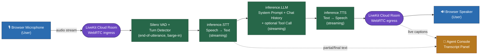

# Implementation Plan: Real-Time Voice Agent (Customer Verification Assistant)

> Hand this file to any coding agent. It contains everything needed to build, test, and deploy the
> assignment end-to-end without further clarification.

## 1. Objective

Build a browser-based, real-time voice agent using **LiveKit Agents** + **LiveKit Cloud** +
**LiveKit Inference** (STT → LLM → TTS) that acts as a **Customer Verification Assistant**.
No paid API keys, no GPU/Docker, must run on a CPU laptop, must use LiveKit's free **Build** plan.

## 2. Hard Constraints (do not violate)

- Use **LiveKit Agents** (Python) with **LiveKit Cloud**.
- Use **LiveKit Inference** for the *entire* STT → LLM → TTS pipeline (via `livekit.agents.inference`
  module, e.g. `inference.STT`, `inference.LLM`, `inference.TTS`, or shorthand strings like
  `stt="deepgram/nova-3:en"`). Do NOT add separate plugin packages/API keys for OpenAI, Deepgram,
  ElevenLabs, Cartesia, etc. — only the `LIVEKIT_*` credentials are needed.
- No locally hosted STT/LLM/TTS models. No GPU/Docker/special hardware.
- Frontend: use the built-in browser-based **LiveKit Agent Console**
  (`https://cloud.livekit.io/projects/p_/agents/console`) — building a custom frontend is optional
  and NOT required.
- Do not commit `.env`, API keys, or credentials. Provide a `.env.example` instead.
- Deliverables: Git repo, README, 2–3 min screen recording (user records this manually — not part
  of code), and a short "production improvements" note.

## 3. Use Case / Conversation Script

The agent must, in order:
1. Greet the customer and introduce itself.
2. Ask for the customer's name.
3. Ask three verification questions:
   - Have you completed your PAN verification?
   - Have you completed your bank-account verification?
   - Have you uploaded your selfie?
4. Be able to answer these FAQs whenever asked:
   - Why is verification required?
   - How long does verification take?
   - Is my information secure?
5. Summarize the customer's responses (name + 3 verification answers) back to them.
6. Ask if the customer needs further assistance.
7. Close the conversation politely.

This logic lives entirely in the **system prompt** (instructions) given to the LLM — no rigid
hardcoded dialogue tree is required, but the prompt must explicitly enumerate this step order and
tell the LLM to keep track of what has already been asked/answered using the conversation history.

## 4. Architecture & Audio Flow



**Flow summary:**
1. **User speaks** → browser captures mic audio and streams it into the LiveKit Cloud room over WebRTC.
2. **VAD + turn detection** decide when the user has finished a turn (and detect barge-in while the agent is speaking).
3. **STT** streams the audio to LiveKit Inference and returns partial/final transcripts.
4. **LLM** receives the transcript plus system prompt + running chat history (and can invoke the mock verification tool), then streams back a text response.
5. **TTS** streams that text to speech.
6. **Agent audio** flows back through the LiveKit room to the browser speaker, while the transcript is shown live in the Agent Console.

- `AgentSession` (from `livekit.agents`) orchestrates the pipeline and keeps `chat_ctx`
  (conversation history) automatically.
- VAD (`silero.VAD`) + LiveKit's turn detector model detect end-of-utterance and enable barge-in.
- Interruption: when the session detects new user speech while TTS audio is still playing, it
  automatically cancels the current TTS/LLM generation and starts processing the new input
  (`allow_interruptions=True`, default). Document this behavior in the README.

## 5. Tech Stack

- Python 3.10+ (project currently has 3.14.6 available).
- `livekit-agents` (core SDK) + `livekit-plugins-silero` (VAD) + `livekit-plugins-turn-detector`
  (optional, for better turn detection) — installed via `pip`/`uv`, NOT manually edited into files.
- Models via LiveKit Inference (pick lightweight, free-tier friendly options; confirm exact names
  against current `docs.livekit.io/agents/models/inference` at build time since model IDs change):
  - **STT**: `deepgram/nova-3` (or `assemblyai/*`) — streaming, English.
  - **LLM**: `openai/gpt-4.1-mini` (or another small/cheap inference model).
  - **TTS**: `cartesia/sonic-3` (or `inworld/inworld-tts-2`).
  - Document the actual chosen models in the README (mandatory requirement).
- `python-dotenv` for local env loading.
- LiveKit CLI (`lk`) for deployment (`lk agent create` / `lk agent deploy`).

## 6. Project Structure

```
voice-agent/
├── agent.py                 # Entrypoint: AgentSession setup, Agent class, prompt, tools
├── prompts.py                # System prompt template (configurable via env var, bonus feature)
├── mock_data.py               # Mock verification-status data for the bonus tool call
├── requirements.txt           # livekit-agents, livekit-plugins-silero, livekit-plugins-turn-detector, python-dotenv
├── .env.example                # LIVEKIT_URL, LIVEKIT_API_KEY, LIVEKIT_API_SECRET (placeholders only)
├── livekit.toml                 # Generated by `lk` CLI for cloud deployment
├── transcripts/                  # Output dir for saved transcripts/JSON summaries (gitignored contents, keep .gitkeep)
├── .gitignore                     # .env, __pycache__, transcripts/*.json, venv
└── README.md
```

## 7. Implementation Steps

1. **Setup**
   - `pip install livekit-agents livekit-plugins-silero livekit-plugins-turn-detector python-dotenv`.
   - Create a free LiveKit Cloud project; copy `LIVEKIT_URL`, `LIVEKIT_API_KEY`,
     `LIVEKIT_API_SECRET` into a local `.env` (never commit it).

2. **`prompts.py`** — define `SYSTEM_PROMPT` as a module-level string (allow override via
   `os.getenv("AGENT_SYSTEM_PROMPT", DEFAULT_PROMPT)` for the "configurable system prompt" bonus).
   Prompt must instruct the LLM to: introduce itself as a verification assistant, ask for name,
   ask the 3 verification questions one at a time, answer the 3 FAQs on demand, summarize at the
   end, ask about further assistance, and close politely. Tell it to use the `check_verification_status`
   tool when the user asks about their current verification status.

3. **`mock_data.py`** — a dict keyed by mock customer name/id with fields `pan_verified`,
   `bank_verified`, `selfie_uploaded` (bonus tool-call data source).

4. **`agent.py`**
   - Define `entrypoint(ctx: agents.JobContext)`.
   - Build `chat_ctx` / instructions from `prompts.SYSTEM_PROMPT`.
   - Define an `Agent` subclass (or plain `Agent(instructions=...)`) with one `@function_tool`
     method `check_verification_status(customer_name: str)` that reads from `mock_data.py` and
     returns a short status string — satisfies the bonus "simple tool call" requirement.
   - Create `AgentSession` with:
     ```python
     session = AgentSession(
         vad=silero.VAD.load(),
         stt=inference.STT(model="deepgram/nova-3", language="en"),
         llm=inference.LLM(model="openai/gpt-4.1-mini"),
         tts=inference.TTS(model="cartesia/sonic-3"),
         turn_detection=MultilingualModel(),  # or default
     )
     ```
   - Register event handlers:
     - `conversation_item_added` → append to an in-memory list AND print to stdout (transcript
       logging requirement); also capture `ev.item.metrics` (`e2e_latency`, `llm_node_ttft`,
       `tts_node_ttfb`) and log them (bonus latency measurement).
     - On session `close`/shutdown → serialize the full transcript + summary to
       `transcripts/<room_name>-<timestamp>.json` (bonus JSON summary storage). Include the four
       collected pieces: customer name, 3 verification answers, timestamp, latency stats.
   - `await session.start(agent=agent, room=ctx.room)`; then `session.generate_reply()` (or let the
     agent's `instructions` trigger the greeting) so the agent speaks first.
   - Call `agents.cli.run_app(agents.WorkerOptions(entrypoint_fnc=entrypoint))` in `if __name__ == "__main__":`.

5. **Error handling** (must implement at least one, implement all three is safer):
   - **No speech detected**: use VAD/`user_away_timeout` or a timer since last user turn; if
     exceeded, have the agent politely prompt again ("Are you still there?") instead of hanging.
   - **Empty transcription**: if STT returns an empty/whitespace string for a turn, skip calling the
     LLM and instead have the agent ask the user to repeat themselves.
   - **Temporary model/API failure**: wrap `inference.LLM`/`inference.STT`/`inference.TTS` in a
     `livekit.agents.llm.FallbackAdapter` (or a simple try/except around `session.generate_reply()`)
     that catches exceptions, logs them, and has the agent say a graceful fallback line
     ("Sorry, I'm having trouble right now, let's try again") rather than crashing.

6. **Interruption handling** — rely on `AgentSession`'s default `allow_interruptions=True` plus VAD;
   explicitly set it and explain in the README that when the user starts speaking during TTS
   playback, the session cancels the in-flight LLM/TTS generation and processes the new user turn.

7. **Local testing**
   - `python agent.py dev` (or `lk agent dev` if using the CLI convention) to run the worker.
   - Test via terminal console mode (`lk agent console`) first, then via the browser-based
     **LiveKit Agent Console** (grant mic permission, click "Save and start session").
   - Manually verify: greeting → name → 3 verification Qs → ask a FAQ mid-flow → interrupt the
     agent while it's talking → confirm it stops and listens → summary → closing.

8. **Deployment**
   - Install LiveKit CLI (`lk`).
   - `lk agent create` (or `lk cloud auth` then deploy) from the project root; this uses
     `livekit.toml` + `requirements.txt` to build and host the worker on LiveKit Cloud, all under
     the free Build plan (no payment method needed).
   - Confirm the deployed agent registers and is reachable from the Agent Console for the demo
     recording.

## 8. README.md must include

- Setup & execution instructions (local + how it was deployed).
- Architecture and audio flow diagram/description (reuse Section 4 above).
- STT, LLM, and TTS models actually used (exact model IDs).
- Explanation of how interruption handling works (Section 6).
- Known limitations (e.g., mock verification data, no persistence beyond JSON file, single active
  session per worker process, English-only).
- Explicit confirmation the solution runs with **no paid services** (LiveKit free Build plan only).
- Mention of any starter templates or AI coding tools used.
- A short "what I'd improve for production" note (e.g., real KYC API integration, persistent DB,
  auth, monitoring/alerting, multilingual support, horizontal scaling, structured logging,
  automated tests, CI/CD).

## 9. Deliverables Checklist

- [ ] Git repo with complete source code, `.gitignore` excluding secrets.
- [ ] `README.md` per Section 8.
- [ ] `.env.example` with placeholder variable names only.
- [ ] Working agent deployed to LiveKit Cloud, reachable via Agent Console.
- [ ] 2–3 min screen recording showing: normal conversation, one interruption, transcript/logs
      (recorded by the user, not generated by code).
- [ ] Short production-improvement note (can live inside README under "Production Improvements").

## 10. Explicitly Out of Scope

Telephony, authentication, databases, custom production deployment infra, multilingual support,
and advanced/custom UI are NOT required — do not spend time building them.
